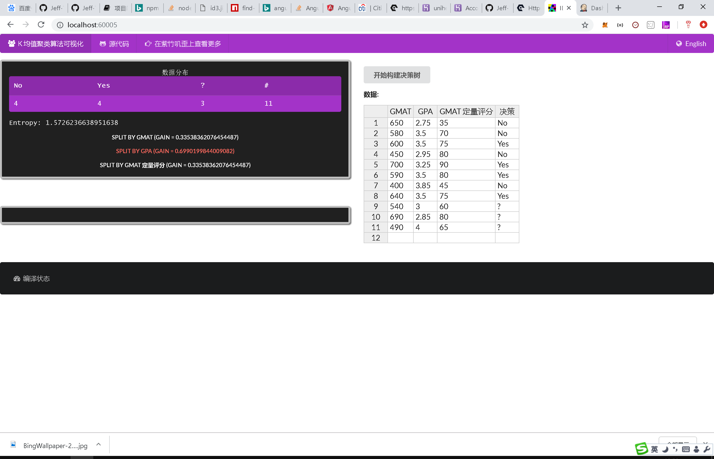

# id3

> Online demo for using id3 algorithm to build the decision tree: https://id3.js.org/.

[](https://travis-ci.com/Jeff-Tian/alpha)
[](https://gitmoji.js.org)

## Run on local machine

```shell
npm install
bower install

npm start
```

Open browser and navigate to: http://localhost:60005/

## Screen shot



## Contribution

This repo welcomes all kinds of issues and Pull Request. For submitting PR, please make sure the relevant tests are
included and all the tests are passed:

```shell
npm test
```
